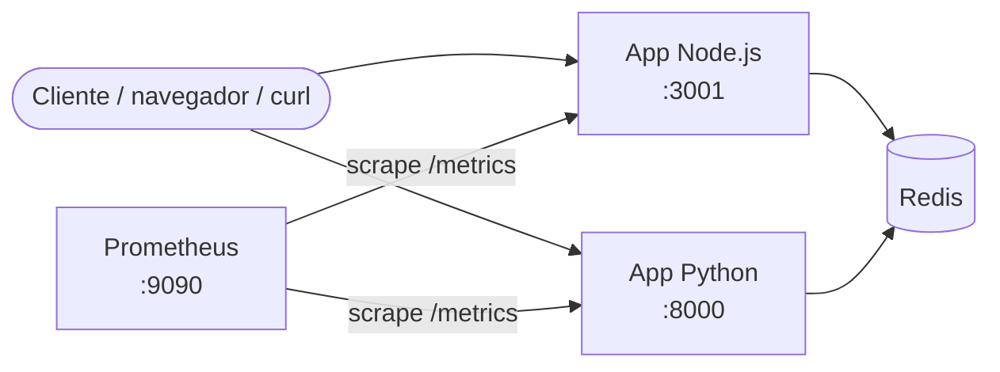
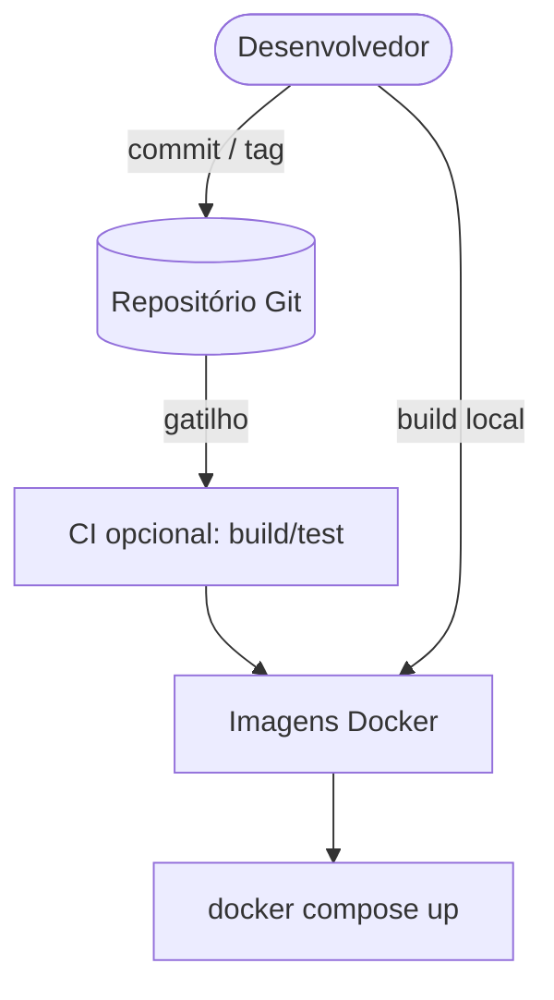
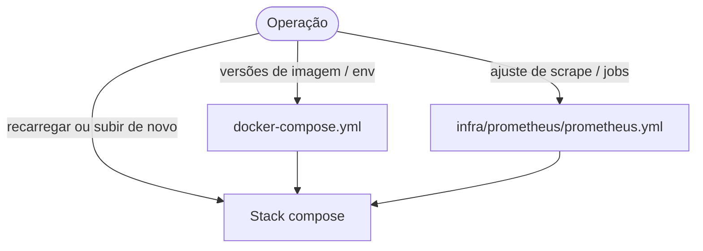

# Arquitetura e análise

## Diagrama (visão de runtime)

- **Redis**: camada de cache compartilhada; TTL **10 s** para a app Node e **60 s** para a app Python (via variável `CACHE_TTL_SECONDS`).
- **Prometheus**: observabilidade mínima — coleta métricas expostas em `/metrics` nas duas aplicações.

## Fluxos de atualização

### Código das aplicações

1. Alterações em `apps/node-service` ou `apps/python-service` entram no Git.
2. Rebuild: `docker compose build` (ou `up --build`) para gerar novas imagens.
3. Deploy/restart dos containers para carregar o novo código.

### Infra (compose, Redis, Prometheus)

- **Redis**: troca de versão via tag da imagem em `docker-compose.yml`; dados em memória são voláteis — em produção usar persistência (AOF/RDB) ou serviço gerenciado.
- **Prometheus**: alterações em `prometheus.yml` exigem restart do container ou reload se `web.enable-lifecycle` estiver habilitado.

### Cache

- Invalidação é principalmente **por TTL** (sem flush manual no fluxo default).
- Para forçar renovação imediata em ambiente de teste: `redis-cli FLUSHALL` no container Redis (não recomendado em produção sem isolamento).

## Pontos de melhoria sugeridos

1. **Alta disponibilidade**: Redis e Prometheus como cluster ou serviços gerenciados; múltiplas réplicas das apps atrás de um load balancer.
2. **Segurança**: não expor Redis e Prometheus publicamente; rede interna apenas, TLS nas APIs, autenticação em `/metrics` se exposto.
3. **Logs**: agregar logs estruturados (JSON) e enviar para Loki ou stack ELK; correlacionar com traces (OpenTelemetry).
4. **Traces**: instrumentar com OTel para latência ponta a ponta (Cliente → app → Redis).
5. **Dashboards**: Grafana consumindo Prometheus para SLO/alertas (latência, taxa de erro, hit rate de cache).
6. **Testes de carga**: validar TTL e contenção no Redis antes de produção.
7. **Cache por rota**: `/time` pode precisar de TTL menor que `/fixed` em cenários reais — hoje o TTL é global por aplicação conforme o desafio.
